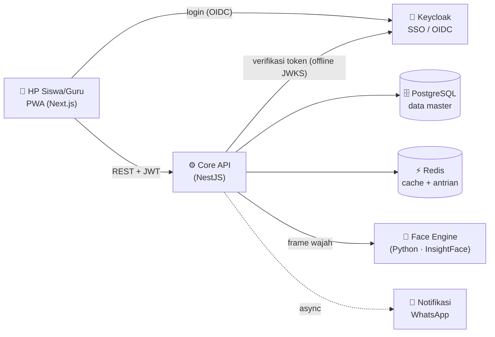
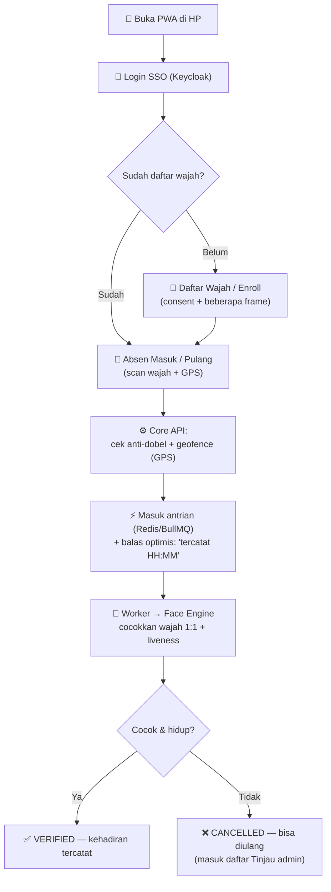
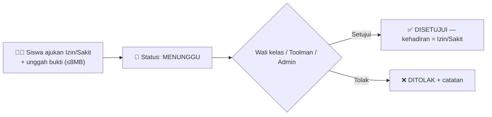

# PUBLICWORK
hanya dipakai ketika kerjaan private to public
<div align="center">

# 🏫 Platform Digital SMK Al-Falah Winong

### Sistem Absensi Wajah + SSO Sekolah — berbasis web & PWA (HP)


*Absensi kehadiran dengan **pengenalan wajah** lewat HP — anti titip absen (liveness + GPS geofience + verifikasi di server). Satu login (SSO) untuk semua aplikasi sekolah.*

</div>

---

> [!IMPORTANT]
> 🔒 **REPOSITORI & SISTEM PRIVAT — internal SMK Al-Falah Winong.**
> **HARAM hukumnya login / mengakses sistem ini dari PC PUBLIK atau komputer umum.** Gunakan **HANYA perangkat pribadi** yang tepercaya. Jaga kerahasiaan akun & dokumen ini.

## 📑 Daftar Isi

1. [Tentang Platform](#-tentang-platform)
2. [Fitur Utama](#-fitur-utama)
3. [Teknologi](#-teknologi)
4. [Arsitektur](#-arsitektur)
5. [Cara Mengakses Aplikasi](#-cara-mengakses-aplikasi)
6. [Akun & Login](#-akun--login)
7. [Hak Akses (RBAC)](#-hak-akses-rbac)
8. [Alur Program](#-alur-program)
9. [Struktur Folder](#-struktur-folder)
10. [Catatan Keamanan](#-catatan-keamanan)

---

## 🎯 Tentang Platform

Platform digitalisasi sekolah untuk **SMK Al-Falah Winong**. Tahap pertama yang sudah berjalan adalah **modul Absensi berbasis wajah (Face-ID)** — siswa & guru cukup memakai **HP** (tanpa mesin/sidik jari/kartu).

| Hal | Keterangan |
|---|---|
| 🎓 Skala | ± 6.000 siswa, 6 jurusan, 162 rombel/tahun |
| 📱 Perangkat | Cukup **HP** (aplikasi PWA, bisa "Add to Home Screen") |
| 🧠 Komputasi wajah | Di **server** (bukan di HP) — InsightFace (SCRFD + ArcFace) |
| 🔐 Satu akun | **SSO Keycloak** — satu login untuk semua aplikasi sekolah |
| 🛡️ Anti-curang | Liveness (gerak/kedip) + **GPS geofence** + cocok wajah di server |
| 🔏 Privasi | Yang disimpan **template wajah terenkripsi**, bukan foto |

> **Jurusan:** Teknik Mesin (TM) · Teknik Otomotif (TO) · TJKT/Jaringan · Teknologi Farmasi (TF) · Akuntansi (AKL) · TKRO.

---

## ✨ Fitur Utama

- ✅ **Absen wajah** masuk & pulang dari HP (verifikasi 1:1 di server).
- ✅ **Daftar wajah (enroll)** sekali di awal — dengan persetujuan (consent).
- ✅ **Anti titip absen**: liveness aktif + GPS geofence (radius dikunci admin) + match di server.
- ✅ **Anti duplikasi wajah** saat enroll (1 wajah tak bisa didaftarkan ke banyak NISN).
- ✅ **Izin / Sakit** + unggah bukti foto/video (≤ 8 MB), dengan alur persetujuan.
- ✅ **Dashboard admin**: monitor per kelas, rekap harian/bulanan/tahunan, kelola wajah.
- ✅ **Login Google** (opsional) — hanya untuk email yang sudah terdaftar.
- ✅ **Import massal** siswa & guru dari **Excel** (otomatis membuat akun SSO).
- ✅ **Kelola User in-app**: buat akun, atur peran + cakupan, reset password, aktif/nonaktif.
- ✅ **Tahan lonjakan**: cache RBAC + antrian (Redis/BullMQ) + worker — kuat saat ribuan absen serentak.
- ✅ **Audit log** & catatan error tersimpan dan tampil di dashboard.
- ✅ **Tema**: ganti warna (hijau/biru/kuning) × mode terang/gelap.

---

## 🧰 Teknologi

| Lapisan | Teknologi |
|---|---|
| **Frontend / PWA** | Next.js 15 (App Router, React 19), TypeScript, Auth.js v5 |
| **Backend (Core API)** | NestJS 11, Prisma ORM |
| **Database** | PostgreSQL 16 |
| **Cache & Antrian** | Redis 7 + BullMQ |
| **SSO / Identitas** | Keycloak 26 (OIDC, realm `sekolah`) |
| **Pengenalan Wajah** | Python + InsightFace (SCRFD detect+align → ArcFace embed) |
| **Hosting** | Hetzner Cloud (Singapura) · **Coolify** (self-host PaaS) · Cloudflare (DNS) |

> Arsitektur: **modular monolith**, satu **database master** (single source of truth). Data master ditulis/dibaca **lewat Core API**. RBAC + scope ditegakkan **di server**, bukan sekadar disembunyikan di UI.

---

## 🏗️ Arsitektur



**Inti keamanan:** JWT diverifikasi **offline** (JWKS) tiap request; RBAC user di-cache di Redis; absen masuk **antrian** lalu diproses **worker** (idempoten) → tahan lonjakan ribuan request serentak.

---

## 🌐 Cara Mengakses Aplikasi

| Untuk | Alamat | Catatan |
|---|---|---|
| **Absensi (siswa & admin)** | `https://absensi.smkalfalahwinong.sch.id` | Buka di **HP**. Semua absen & dashboard admin di sini. |
| **Portal sekolah** | `https://portal.smkalfalahwinong.sch.id` | Halaman utama / login SSO. |
| **Login SSO (Keycloak)** | `https://accounts.smkalfalahwinong.sch.id` | Halaman ketik user/password. |
| **Console admin SSO** | `https://accounts.smkalfalahwinong.sch.id/admin` | Kelola user Keycloak (super-admin). |
| **Core API** | `https://api.smkalfalahwinong.sch.id` | Mesin data (tidak dibuka manual). |
| **Face Engine** | `https://face.smkalfalahwinong.sch.id` | Mesin wajah (internal). |
| **Monitoring server** | `https://monitor.smkalfalahwinong.sch.id` | Netdata (CPU/RAM/disk, jam WIB). |

**Cara pakai (siswa):** buka `absensi.` di HP → **Masuk via SSO** → **🙂 Daftar Wajah** (sekali) → **🟢 Absen Masuk** / **🔵 Absen Pulang**.

**Cara pakai (admin/kepsek):** login → di beranda muncul tombol **🛠️ Buka Dashboard Admin** → `/admin`.

---

## 👤 Akun & Login

> [!WARNING]
> **Repositori PRIVAT.** Akun di bawah adalah akun **DEMO/UJI** untuk pengembangan. **Ganti semua password sebelum dipakai produksi nyata.** **Secret infrastruktur** (root server, token API, kunci enkripsi wajah) **sengaja TIDAK dicantumkan di sini** dan disimpan privat.
> 🔒 **HARAM login / mengakses akun ini dari PC PUBLIK** — hanya dari **perangkat pribadi** yang tepercaya.

Login lewat tombol **"Masuk via SSO"** di `absensi.` / `portal.`. Realm aplikasi = **`sekolah`**.

**Admin & guru (demo):**

| Peran | Username | Password | Lingkup |
|---|---|---|---|
| Kepala sekolah (admin penuh) | `kepsek` | `password` | Semua jurusan + Pengaturan |
| Guru | `alexsander@smkalfalahwinong.sch.id` | `geforce7` | Guru Produktif + Jurusan TJKT + Mengampu Walikelas X TJKT 1 hanya bisa melihat scope yang diset admin |

**Kepala Jurusan (demo — password semua `kajur123`):**

| Username | Jurusan |
|---|---|
| `kajur.tm` | Teknik Mesin |
| `kajur.to` | Teknik Otomotif |
| `kajur.tjkt` | TJKT (jaringan) |
| `kajur.tf` | Teknologi Farmasi |
| `kajur.akl` | Akuntansi (AKL) |
| `kajur.tkro` | TKRO |

**Siswa uji (untuk tes wajah):**

| Username | Password |
|---|---|
| `8020` … `8020` | `8020` |
| `8021` … `8021` | `8021` |
| `8022` … `8022` | `8022` |
| `8023` … `8023` | `8023` |
| `8024` … `8024` | `8024` |
| `8025` … `8025` | `8025` |

> **Akun hasil import massal:** Siswa → username = **NISN**, password awal = **NISN**. Guru → username = **NIP/NUPTK/email**, password awal = username. **Wajib ganti password saat login pertama.**

---

## 🛡️ Hak Akses (RBAC)

Otorisasi memakai **peran (role)** + **cakupan (scope)**. Scope membatasi *data mana* yang boleh dilihat:

- **GLOBAL** — semua sekolah · **JURUSAN** — satu jurusan · **ROMBEL** — satu kelas.

Contoh: *kajur TJKT* hanya melihat data kelas TJKT; *wali kelas* hanya kelasnya. Ditegakkan **di server**.

### Daftar Peran (13 role)

| Peran | Keterangan | Cakupan umum | Kemampuan utama |
|---|---|---|---|
| `superadmin` | IT pusat | GLOBAL | **Semua izin** |
| `kepsek` | Kepala sekolah | GLOBAL | Lihat semua, dashboard, **setelan absen**, approve izin, kelola user, audit |
| `waka` | Wakil kepala | GLOBAL | Lihat semua, dashboard, setelan absen, approve izin |
| `kajur` | Kepala jurusan | JURUSAN | Dashboard + rekap jurusannya, approve izin |
| `tu` | Tata usaha | GLOBAL | Kelola data master & user, import, dashboard absen |
| `bendahara` | Keuangan | GLOBAL | SPP / tagihan |
| `guru` | Guru pengajar | JURUSAN/penugasan | Lihat siswa, absen manual, input nilai, dashboard |
| `wali_kelas` | Wali kelas | ROMBEL | Dashboard kelasnya, approve izin, cetak rapor |
| `bk` | Bimbingan konseling | GLOBAL/JURUSAN | Lihat siswa & absen, approve izin |
| `toolman` | Absen manual & cocokkan data | sesuai tugas | Absen manual, tinjau absen gagal, approve izin |
| `operator` | Operator Dapodik | GLOBAL | Kelola & import data master |
| `siswa` | Siswa | diri sendiri | **Absen wajah**, daftar wajah, ajukan izin, lihat data pribadi |
| `ortu` | Orang tua/wali | anaknya | Pantau nilai, absen, tagihan, ajukan izin |

### Daftar Izin (24 permission)

<details>
<summary><b>Klik untuk lihat semua permission</b></summary>

| Kode | Arti |
|---|---|
| `master.read` / `master.manage` | Lihat / kelola data master (jurusan, rombel, mapel) |
| `siswa.read` / `siswa.manage` | Lihat / kelola data siswa & enrollment |
| `siswa.import` / `pegawai.import` | Import massal siswa / guru via Excel (+ buat akun SSO) |
| `absen.read` | Lihat absensi / rekap (scoped) |
| `absen.kelola` | Dashboard absensi: monitor / rekap / kelola wajah |
| `absen.input` | Catat / ubah absensi manual (wali kelas / piket) |
| `absen.scan` | Absen kehadiran diri sendiri (wajah) |
| `absen.enroll` | Daftarkan wajah (butuh consent) |
| `absen.setting` | Atur jam masuk/pulang & geofence |
| `izin.ajukan` / `izin.approve` | Ajukan / setujui-tolak izin & sakit |
| `nilai.read` / `nilai.input` / `nilai.edit` | Lihat / input / ubah nilai |
| `rapor.read` / `rapor.cetak` | Lihat / cetak rapor & transkrip |
| `spp.read` / `spp.manage` | Lihat / kelola tagihan & pembayaran |
| `user.manage` / `role.manage` | Kelola akun & penugasan / kelola role & permission |
| `audit.read` | Baca audit log |

</details>

---

## 🔄 Alur Program

### Alur Absensi Siswa



### Alur Izin / Sakit



### Alur Login Admin

```
Buka absensi. → Masuk via SSO → (server cek peran & izin)
   ├─ punya 'absen.kelola' → muncul tombol "🛠️ Dashboard Admin" → /admin
   └─ siswa biasa          → hanya menu absen pribadi
```

---

## 📂 Struktur Folder

```
smk-alfalah-platform/
├── apps/
│   ├── absen/            # PWA Absensi (Next.js) — siswa + dashboard admin
│   └── web/              # Portal sekolah (Next.js)
├── services/
│   ├── core-api/         # Core API (NestJS) — logika + RBAC + audit
│   │   └── src/absensi/  #   modul absensi (inti)
│   └── face-engine/      # Face Engine (Python/InsightFace)
├── packages/
│   └── db/               # Skema database & seed (Prisma)
├── infra/
│   └── keycloak/         # Tema login Keycloak (kustom sekolah)
└── docs/                 # Dokumentasi teknis (arsitektur, roadmap, status)
```

---

## 🔒 Catatan Keamanan

- 🔏 Yang disimpan adalah **template wajah terenkripsi** (AES-256-GCM), **bukan foto** — sesuai semangat UU PDP.
- 🛡️ **Anti titip absen**: liveness aktif + GPS geofence (radius dikunci admin) + verifikasi wajah **di server**.
- 🔐 **SSO + RBAC**: satu identitas, otorisasi ditegakkan di Core API (bukan hanya disembunyikan di UI).
- 🔒 **Repositori PRIVAT.** **HARAM login / mengakses sistem dari PC PUBLIK / komputer umum** — gunakan **hanya perangkat pribadi** yang tepercaya.
- 🚫 **Jangan** menaruh secret produksi (password root, token API, kunci enkripsi) di repositori publik. Semua secret nyata disimpan privat (di luar dokumen ini).
- 🔑 Ganti password akun demo sebelum dipakai produksi nyata.

---

<div align="center">

**SMK Al-Falah Winong** · Platform Digital Sekolah
*Dokumen ringkasan — untuk detail teknis lihat folder `docs/`.*

</div>
